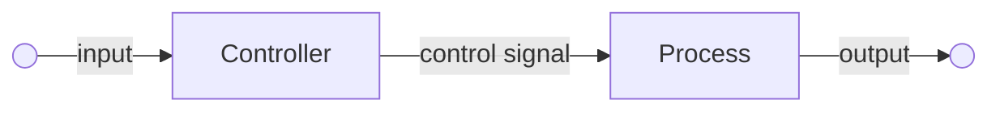
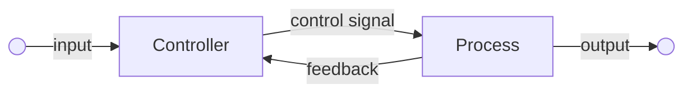

# Quiz 1 Review

**When is a city function smart?**

It can collect information, make decisions in response to real environment without human intervention needed.

A smart city is a collection of CPS (cyber-physical system = cyber part + physical part)

Example: Fully autonomous self-driving

**What is the difference between control and optimization?**

|                 | Control                  | Optimization             |
| --------------- | ------------------------ | ------------------------ |
| **Methodology** | Decisions in real time   | Decisions at one shot    |
| **Objective**   | Find a feasible solution | Find an optimal solution |
| **Application** | Electrical Engineering   | Industrial Engineering   |

**How to write the four-stage formulation of a decision-making problem?**

- Data — the useful data from environment we need for simulation
- Decision Variables — parameters that we need to control/optimize
- Constraints — the restraints that we need to follow for the problem
- Objective — the goal state we need to reach or the function we need to optimize

**What is the difference between centralized and decentralized decision-making?**

|                  | centralized                              | decentralized                           |
| ---------------- | ---------------------------------------- | --------------------------------------- |
| **Objective**    | send instructions to each vehicle        | objects make decisions independently    |
| **Optimization** | optimize global system-level performance | optimize local object-level performance |
| **Requirment**   | extensive information and communication  | little communication and collaboration  |
| **Result**       | some win — some lose                     | some efficient — some inefficient       |

Combination of centralized and decentralized decision-making is more common for reality

**What is the difference between open-loop and closed-loop decision-making?**

Open-loop decision-making (policy-free)

Decides all decision variables $\{ x_i \}$ at the very beginning

Closed-loop decision-making (policy-based)

Decides a policy $\pi(s_i) \to x_{i+1}$ to calculate decision variables during the process

|                     | open-loop (policy-free)              | closed-loop (policy-based)                    |
| ------------------- | ------------------------------------ | --------------------------------------------- |
| **Requirements**    | less hardware                        | more hardware for observation and computation |
| **Flexibility**     | more flexible                        | restricted by policy                          |
| **Fault-tolerance** | immune to erroneous data             | vulnerable to erroneous data                  |
| **Stability**       | errors accumulate continuously       | keep dealing with errors                      |
| **Adaptiveness**    | maladaptive to unexpected situations | adaptive to unexpected situations             |
| **Intuitiveness**   | less intuitive                       | more intuitive                                |

**What are the actions involved in driving?**

- selecting route
- keeping or changing lane
- rotating steering wheel
- pushing/releasing throttle/brake/clutch
- changing gear
- turning on signal lights

**What information needs to be observed to enable autonomous driving?**

- navigation and route planning
- Road lanes and markings
- Traffic signs and signals
- Pedestrians, non-motor vehicles and other motor vehicles 
  (position, speed, direction, movement, signals)
- Obstacles

**What are some maneuvers that a computer driver can do but a human driver cannot?**

- keep lane with a very small distance from the front cars
- change lane in a very high speed with sufficient safety

**What do longitudinal and lateral controls do?**

|            | Longitudinal                  | Lateral                                           |
| ---------- | ----------------------------- | ------------------------------------------------- |
| **Device** | throttle, brake, clutch       | steering wheel                                    |
| **Action** | push, release                 | turn in different angles                          |
| **Result** | acceleration, speed, position | angular acceleration, angular velocity, direction |

**How to formulate the longitudinal control problem?**

Longitudinal four-stage formulation

- Data
  - Vehicle parameters
  - Reference data
- Decision Variable
  - Torque generated by the engine $T_e$
- Constraints
  - Vehicle dynamics
  - Environment restrictions
- Objective
  - Make the vehicle move in the expected route or reach the expected goal

Longitudinal dynamics

- Vehicle mass $m$
- Vehicle speed $v$
- Propelling force $F_p$
- Resisting force $F_r = F_a + F_g + F_{rr}$
  - Aerodynamic force $F_a = \dfrac{1}{2} \rho C_dv^2$
  - Gravitational force $F_g = mg \sin\theta$
  - Rolling resistance force $F_{rr} = C_r mg \sin\theta$
- Dynamic equation $mv^\prime = F_p - F_r$

Longitudinal dynamics with torque $T_e$ — $v^\prime = \dfrac{1}{M_t} \left( T_e - R_gT_b - R_gRF_r \right)$

**What are reference and actual speeds?**

reference speed is predefined data indicating the speed we want the vehicle to reach during the process

actual speed is the real speed the vehicle reaches affected by saturation, noise, vehicle limitations during the process

**What is asymptotic stability?**

The actual data converges to the reference data, and they eventually becomes equivalent

**How to do speed tracking, position tracking, and vehicle following?**

- speed tracking — actual speed approaches reference speed
- position tracking — actual position approaches reference position
- vehicle following — actual position follows the leading vehicle

**Why do we sometimes want to linearize a model?**

Linear model is much easier to compute, to optimize and to analyze compared with non-linear model

Sometimes it is not computationally feasible to use a non-linear model to solve the problem

**What is control saturation?**

The expected decision variable exceeds the upper bound due to technical constraints

**How to incorporate noise in system dynamics?**

add a term $\varepsilon$ following a certain distributions to every update

**What is model identification?**

- determine and verify the form of the dynamic equation
- determine and verify the parameters of the dynamic equation

**How to formulate the trajectory planning problem?**

2-Dimensional trajectory problem

- Data
  - Initial position $x_0$
  - Target position $D$
  - Initial direction $\theta_0$
  - Target direction $\varphi$
  - Valid space $\mathbb{S}$
  - Maximum speed $x_m$
  - Maximum acceleration $a_m$
  - Maximum angular speed $\omega_m$
  - Maximum angular acceleration $\phi_m$
  - Fuel rate $f$
  - Air drag $F_r$
  - Time step $\Delta t$
  - Time upper bound $T$
- Decision Variables
  - speed $v$
  - angular speed $\omega$
- Constraints
  - Initial position $x(0) = x_0$
  - Target position $x(T) \ge D$ or $x(T) = D$
  - Initial direction $\theta(0) = \theta_0$
  - Target direction $\theta(T) = \varphi$
  - Road space $x(t) \in \mathbb{S}$
  - acceleration $-a_m \le a(t) \le a_m$
  - speed $0 \le v(t) \le v_m$
  - angular acceleration $-\phi_m \le \phi(t) \le \phi_m$
  - angular speed $-\omega_m \le \omega(t) \le \omega_m$
  - position update $x(t + \Delta t) = x(t) + \left( \begin{matrix} v(t) \cos\theta(t) \\ v(t) \sin\theta(t) \end{matrix} \right) \Delta t$
  - direction update $\theta(t + \Delta t) = \theta (t) + \omega(t) \Delta(t)$
  - acceleration $a(t) = \dfrac{v(t) - v(t - \Delta t)}{\Delta t}$
  - angular acceleration $\phi(t) = \dfrac{\omega(t) - \omega(t - \Delta t)}{\Delta t}$
- Objective
  - minimize fuel cost $\displaystyle\sum \Big[  f(t) \Delta t \Big]$

**What is a linear programming, and what is a quadratic programming?**

Linear programming

- optimization variables $x$
- objective function $J = Qx + r$ 
- inequality restraints $Gx \le h$ 
- equality restraints $Ax = b$ 

Quadratic programming

- optimization variables $x$
- objective function $J = \dfrac{1}{2} x^TPx +  Qx + r$
- inequality restraints $Gx \le h$
- equality restraints $Ax = b$

where $P, Q, r, G, h, A, b$ are matrix with suitable sizes

**What is a convex optimization problem?**

- optimization variables $x$
- objective function $J = f(x)$
- inequality restraints $g(x) \le 0$
- equality restraints $h(x) = 0$

where $f(x), g(x)$ are convex functions

**What is a feasible solution, and what is an optimal solution?**

A feasible solution is a solution satisfying all the restraints

An optimal solution is the feasible solution minimize/maximize the objective function

**When does the trajectory planning have no feasible solutions?**

The vehicle cannot reach the goal within the constraints

- $T$ too small — no sufficient time for the vehicle
- $D$ too large — unreachable target position for the vehicle
- $a_m$ too small — the vehicle cannot reach a very high speed in short time
- $v_m$ too small — the vehicle can only maintain a low speed during the process

**What is a control policy or a control law?**

The update function for policy-based control method

$x_{i+1} = \pi (s_i)$

**What is vehicle platooning?**

Control a group of vehicles together with very small distance between adjacent vehicles

**What is the motivation for platooning?**

- save fuels due to less air drag
- reduce traffic jams due to small inter-vehicle distance
- improve safety and working conditions for human drivers

**What is the technological basis for platooning?**

- CACC (Cooperative Adaptive Cruise Control)
  - cooperative — multiple vehicles share information and jointly make decisions
  - adaptive — control inputs are generated in response to real-time condition
- AV (Autonomous Driving)
  - longitudinal — vehicle following
  - lateral — lane keeping and lane changing
- Vehicle-to-vehicle Coordination
  - On Board Unit (OBU)
  - Broadcast information

**What is a neural network?**

A neural network is a large collection or nodes called neurons, and each neuron represents a single combination of a linear function and an activation function.

**How do we use a neural network to approximate a function?**

- Initialize a neural network with suitable size
- Use preprocessed data to train the neural network
- The trained neural network 

**Why neural networks was not popular until recently?**

- hardware requirement — need colossal computation
- theoretical basis — lack of systematic analysis
- prospect — no suitable application in any aspect

**What is a signal-free intersection?**

The intersection without traffic signals (traffic lights, road markings…)

**What is the difference between a conventional and a high-speed signal-free intersection?**

|                | conventional                | high-speed signal free        |
| -------------- | --------------------------- | ----------------------------- |
| Environment    | signalized                  | not signalized                |
| Communications | by convention               | by network                    |
| Crossing order | according to traffic lights | according to optimal planning |
| Efficiency     | less efficient              | more efficient                |

**Why latency can lead to efficiency loss at a high-speed signal-free intersection?**

Latency may cause bounded uncertainty over the trajectory, so the safe distance need to be enlarged compared to the ideal situation. Therefore, the efficiency will be reduced by latency.

**What are some system-level decisions involved by vehicle platooning?**

decisions related to multi-vehicle system

High-level

- trip scheduling
- route planning

Middle-level

- Headway regulation
- Coordinated time of arrival

**What are some pros and cons of a long vehicle platoon?**

pros

- more efficient and safer compared with decomposed platoons

cons

- have more latency and need more computation time
- may lead to local congestion and disrupt local traffic
- may cause inconvenience to other social vehicles

**When do we say the traffic queue at an intersection to be stable?**

The traffic queue at an intersection is stable is the average inflow is lower than the capacity

Or say, the traffic queue will always have finite numbers of vehicles in any initial condition

$\limsup\limits_{t \to \infty} \left[ \dfrac{1}{t} \displaystyle \sum_{s=0}^{t} E(X_1(t) + X_2(t)) \right] \le Z$ where $Z$ is a finite number

**How to write the transition probabilities for the traffic queues at an intersection?**

One step of transition probabilities

$a = 1$ if ($Y = 0$ or $Y = A$) and ($X_Y > 0$)

- $p =  (1-p_1) (1 - p_2)\quad X_Y \leftarrow X_Y - a$
- $p = p_1(1 - p_2) \quad X_Y \leftarrow X_Y - a \quad X_1 \leftarrow X_1 + 1$
- $p = ( 1 - p_1 ) p_2 \quad X_Y \leftarrow X_Y - a \quad X_2 \leftarrow X_2 + 1$
- $p = p_1 p_2 \quad X_Y \leftarrow X_Y - a \quad X_1 \leftarrow X_1 + 1 \qquad X_2 \leftarrow X_2 + 1$

**What is the relation between traffic flow, traffic density, and traffic speed?**

- traffic flow $f$ — numbers of vehicles passing a fixed cross-section during unit time
- traffic density $\rho$ — numbers of vehicles per unit road space
- traffic speed $v$ — aggregate speed of traffic

$f = \rho v$

**How to evaluate the efficiency of a highway?**

Low demand rejection, low vehicle hours traveled and high throughput.

**How does the environment affect the flow-density relation?**

Triangular model for more realistic approximation

Flow-density relation $f = \min \{ v\rho, w(\rho_m - \rho) \}$

Critical density $\rho_c = \dfrac{w}{v + w} \rho_m$

Capacity $f_c = v\rho_c = \dfrac{vw}{v+w} \rho_m$

where $\rho_m$ is maximal density, $w$ is congestion wave speed, $v$ is free-flow speed

**Does a linear min-cost flow problem capture congestion effect on links?**

No. The linear min-cost flow problem ignores the congestion effect on links.

**How to construct an optimal solution to an uncapacitated min-cost flow problem?**

Uncapacitated min-cost flow problem indicates no upper bound for flow $f_{ij}$

We can construct a programming problem (convex optimization problem) to find the optimal solution

